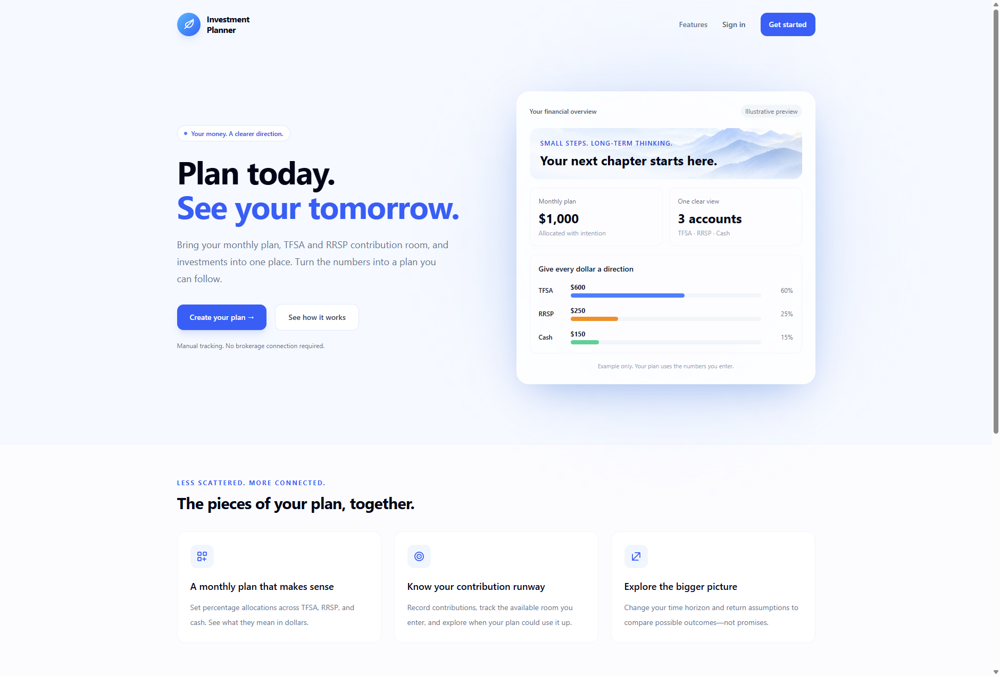
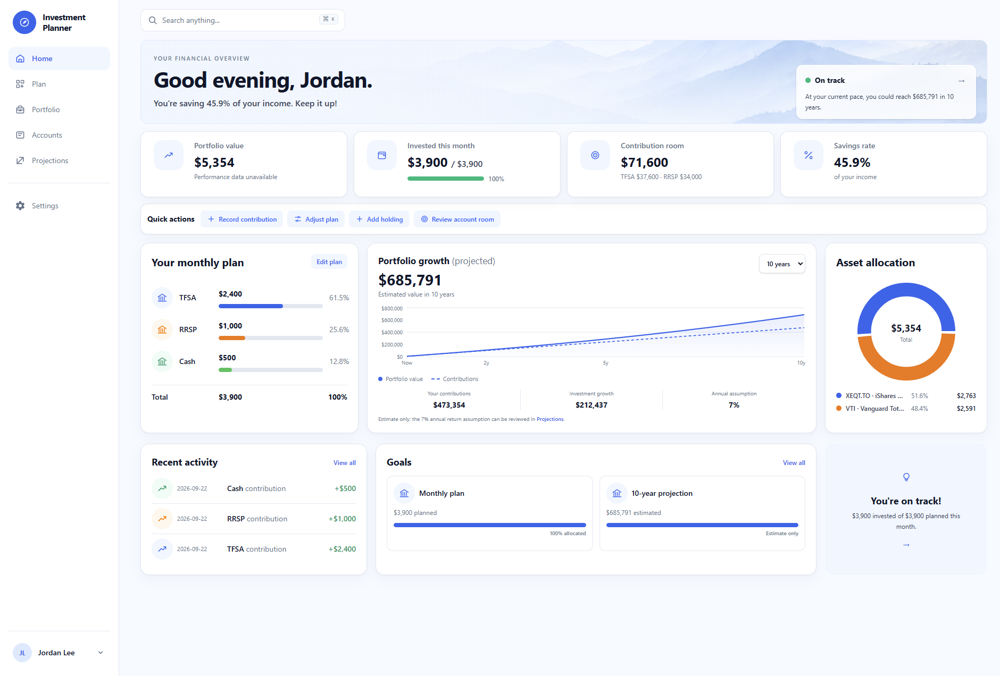
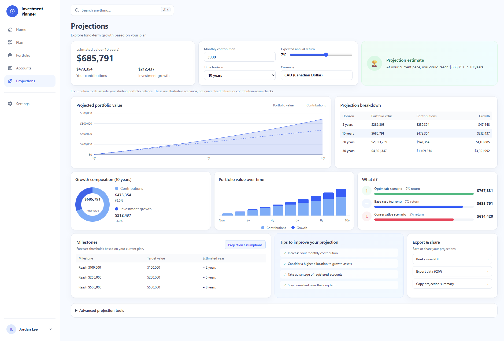

# Investment Planner

Investment Planner is a multi-user Next.js app for turning monthly income and expenses into an actionable investment plan. It supports TFSA/RRSP allocation, contribution-room tracking, holdings, CAD/USD FX calculations, projections, and live Yahoo Finance quotes.

## Introduction

Start with the public [Investment Planner landing page](https://investment-tracking-two.vercel.app/). It introduces the product before visitors create an account or sign in, then guides them into the planning experience.



## What it does

- Converts a financial baseline into a monthly TFSA, RRSP, and cash allocation.
- Tracks recorded contributions against the current plan and available registered-account room.
- Keeps holdings and asset allocation in one place, with current CAD values.
- Models long-term portfolio growth, contribution runway, scenarios, and milestones.

## Product walkthrough

The screenshots use fictional demo data. Financial projections are illustrative and are not investment advice.

### Dashboard

The dashboard provides a concise view of portfolio value, monthly progress, available contribution room, allocation, recent activity, and projected growth.



### Projections

The Projections page presents long-term value estimates, a contribution-versus-growth breakdown, scenarios, and planning milestones.



## Stack

- Next.js App Router, React, TypeScript, and Tailwind CSS
- Supabase Postgres, Auth, and row-level security
- Yahoo Finance server-side market data with a short-lived database cache
- Recharts for interactive charts and Vitest for engine tests

## Local setup

1. Install Node.js (the project is tested with Node 20+), then install dependencies:

   ```bash
   npm install
   ```

2. Create a Supabase project. Copy `.env.example` to `.env.local` and fill in:

   - `NEXT_PUBLIC_SUPABASE_URL`
   - `NEXT_PUBLIC_SUPABASE_ANON_KEY`
   - `SUPABASE_SERVICE_ROLE_KEY` (server-only; never expose it to the browser)

3. Run [`src/db/migrations/0001_init.sql`](src/db/migrations/0001_init.sql), then [`src/db/migrations/0002_atomic_contributions.sql`](src/db/migrations/0002_atomic_contributions.sql), in the Supabase SQL editor. They create the schema, policies, starter instruments, and atomic contribution recording.

4. Start the development server:

   ```bash
   npm run dev
   ```

   Open http://localhost:3000 and create an account. Set your financial plan inputs on the Plan page before using the dashboard.

Run checks with `npm test` and `npx tsc --noEmit`.

## Deployment

See [DEPLOYMENT.md](DEPLOYMENT.md) for the Vercel and Supabase setup, authentication redirects, and post-deployment checks. Keep the service-role key server-only.
